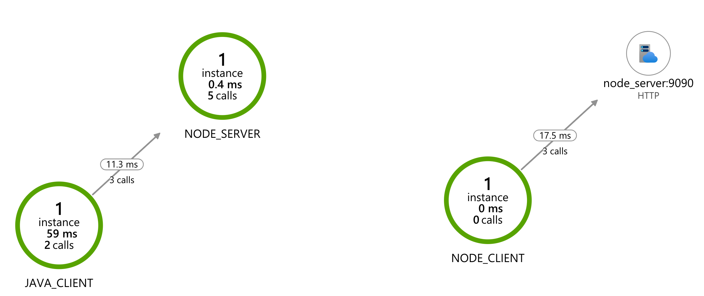

# Tracing problem for NodeJS Application Insight client.
When using tracing with Application Insights we've seen that headers are missing in certain cases.

We have created a simple project illustrating the problem. We have a simple nodejs server (node_server) that logs all request headers sent to it. And we have both a nodejs client (node_client) and java client (java_client) that perform requests to the nodejs server.

We test three types of requests from these clients:
* on startup: a request to the server is initiated directly after the application is started
* scheduled: a request to the server is made at scheduled intervals
* on-demand: a request to the server is initiated by an incoming request, for example an external http request to the client application forces a request to the server

Using the nodejs client, we see that the `request-context` headers are not complete during application startup and at scheduled intervals. On-demand requests seem to contain all the required headers.

When we compare the behavior of the nodejs client and the java client, we see that the java client sends complete headers with every type of request, whereas the nodejs client is missing headers for "startup" and "scheduled" requests. We also see the outcome of this in the Application Map in Application Insights: without any "on-demand" requests, the node_client never gets connected to the node_server in the map.

## How to reproduce
The server will output the request headers

1. Get a valid instrumentationKey from Azure Application Insights where you want the telemetry to end up
2. Run `APP_INSIGHTS_KEY=XXX-YYY-ZZZ docker compose up --build`
3. The nodejs and java clients will make a request on startup to the server
4. Wait a minute for the nodejs and java clients to send scheduled requests
5. Look at the console logs for node_server and note the difference in (and lack of) headers that are being sent for each type of request.
6. Wait a few minutes (why the painful delay Microsoft?) and check the Application Map in Application Insights. You will see that "node_client" is not connected to "node_server", however "java_client" is. <br>
7. Run some "on-demand" requests to the nodejs client `curl http://localhost:6060/client` and after a few minutes in the app insights GUI you'll see that node_client is now connected to node_server. <br>

## Results

### nodejs client

#### application startup requests
The nodejs client initiates a call to the server immediately upon application startup.
```
node_server_1  | {
node_server_1  |   "source": "on-startup",
node_server_1  |   "request-context": "appId=cid-v1:",
node_server_1  |   "user-agent": "axios/0.21.1",
node_server_1  | }
```

#### application startup requests (delayed)
The nodejs client initiates a call to the server after a small delay after application startup.
```
node_server_1  | {
node_server_1  |   "source": "on-startup-delayed",
node_server_1  |   "request-context": "appId=cid-v1:65671f72-5cc8-4676-88de-164e720bd7d0",
node_server_1  |   "user-agent": "axios/0.21.1",
node_server_1  | }
```

#### scheduled requests
The nodejs client initiates a call to the server at scheduled intervals (using `node-scheduler`)
```
node_server_1  | {
node_server_1  |   "source": "scheduled",
node_server_1  |   "request-context": "appId=cid-v1:65671f72-5cc8-4676-88de-164e720bd7d0",
node_server_1  |   "user-agent": "axios/0.21.1",
node_server_1  | }
```

#### "on-demand" requests
A request is made to the nodejs client and the client then initiates a call to the server.
```
node_server_1  | {
node_server_1  |   "source": "on-demand",
node_server_1  |   "request-context": "appId=cid-v1:65671f72-5cc8-4676-88de-164e720bd7d0",
node_server_1  |   "request-id": "|685c330fbf7b4743951f74de4435b8c0.f858ec4f993945cf.",
node_server_1  |   "x-ms-request-id": "685c330fbf7b4743951f74de4435b8c0",
node_server_1  |   "x-ms-request-root-id": "|685c330fbf7b4743951f74de4435b8c0.f858ec4f993945cf.",
node_server_1  |   "traceparent": "00-685c330fbf7b4743951f74de4435b8c0-f858ec4f993945cf-01",
node_server_1  |   "user-agent": "axios/0.21.1",
node_server_1  | }
```


### java client

Using a simple spring-boot java client having similar logic to the nodejs client, we see that headers are being sent in all cases: application startup, scheduled intervals, on-demand.

#### application startup requests
The java client initiates a call to the server immediately upon application startup.
```
node_server_1  | {
node_server_1  |   "source": "startup",
node_server_1  |   "request-id": "|b1e92fb165e4d58698d344efed8bdb6b.ababd18db5a2c37f.",
node_server_1  |   "request-context": "appId=65671f72-5cc8-4676-88de-164e720bd7d0",
node_server_1  |   "traceparent": "00-b1e92fb165e4d58698d344efed8bdb6b-ababd18db5a2c37f-01",
node_server_1  |   "user-agent": "Java/11.0.12",
node_server_1  | }
```

#### scheduled requests
The java client initiates a call to the server at scheduled intervals
```
node_server_1  | {
node_server_1  |   "source": "scheduled",
node_server_1  |   "request-id": "|1e7e4980443ac235da675eceefa58fd2.0fa519b17901e486.",
node_server_1  |   "request-context": "appId=65671f72-5cc8-4676-88de-164e720bd7d0",
node_server_1  |   "traceparent": "00-1e7e4980443ac235da675eceefa58fd2-0fa519b17901e486-01",
node_server_1  |   "user-agent": "Java/11.0.12",
node_server_1  | }
```

#### "on-demand" requests (requests initiated by an incoming request)
A request is made to the java client and the client then initiates a call to the server.
```
node_server_1  | {
node_server_1  |   "source": "on-demand",
node_server_1  |   "request-id": "|c6a9df58736b881dfe7c91b148cd2efb.9b7e6bacf4efd642.",
node_server_1  |   "request-context": "appId=65671f72-5cc8-4676-88de-164e720bd7d0",
node_server_1  |   "traceparent": "00-c6a9df58736b881dfe7c91b148cd2efb-9b7e6bacf4efd642-01",
node_server_1  |   "user-agent": "Java/11.0.12",
node_server_1  | }
```


## Useful links
https://www.npmjs.com/package/applicationinsights

https://www.npmjs.com/package/node-schedule

https://docs.microsoft.com/en-us/azure/azure-monitor/app/nodejs

https://docs.microsoft.com/en-us/azure/azure-monitor/app/correlation
